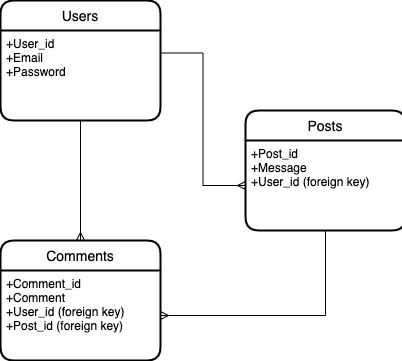
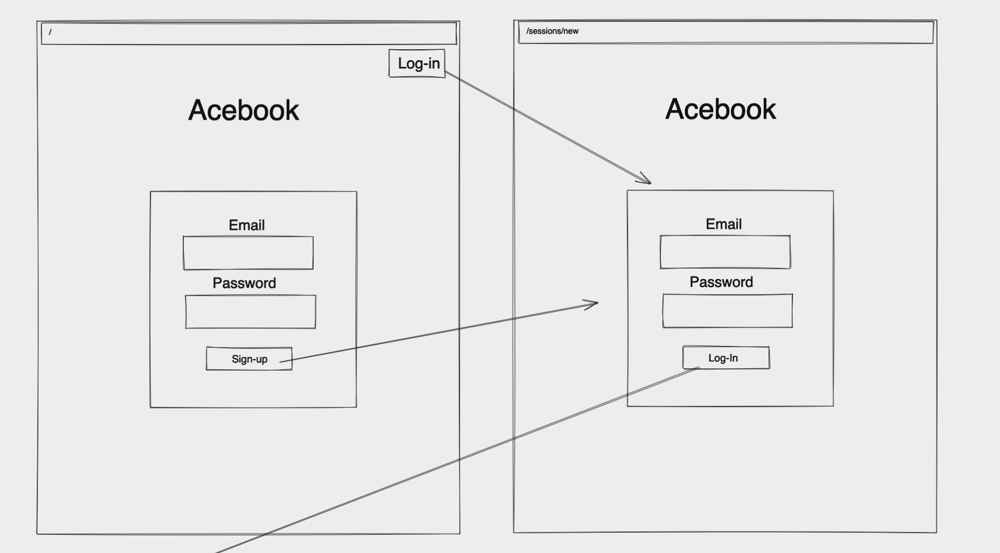
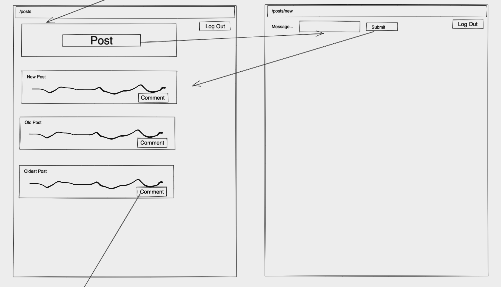
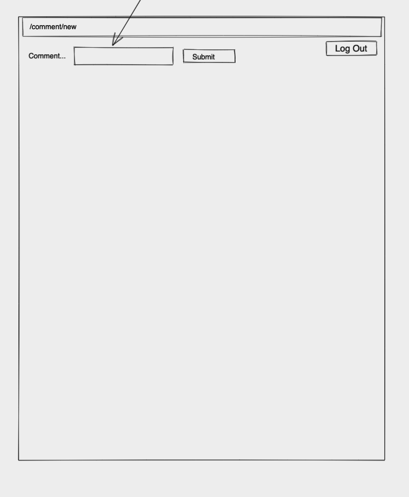
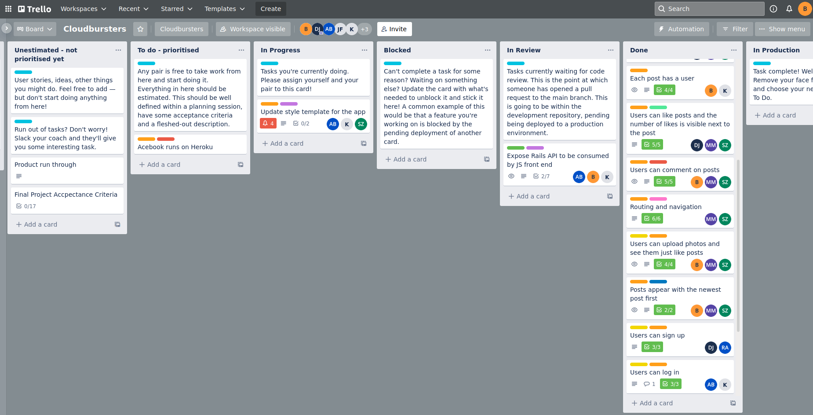
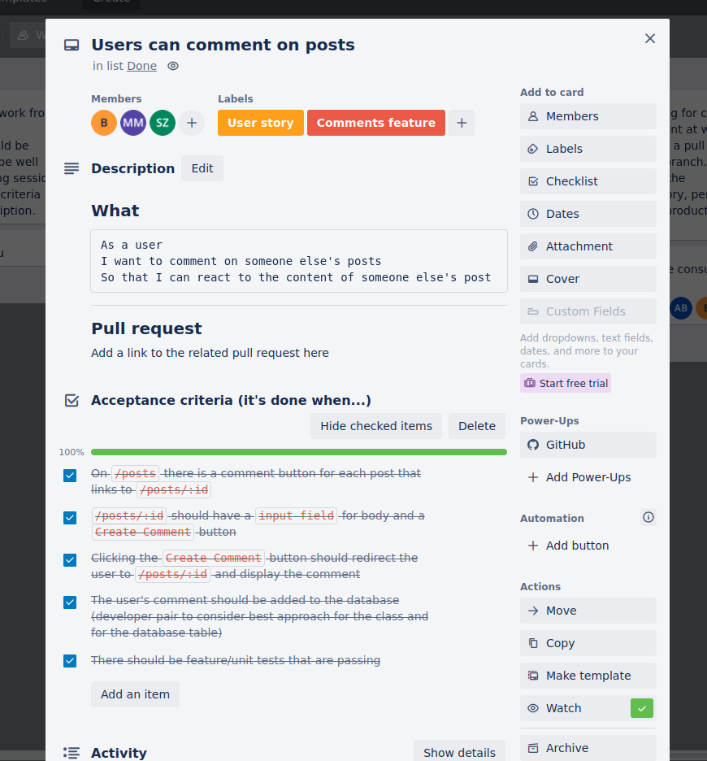

# AceBook

Working in a team of 7, during weeks 8 and 9 of the Makers Academy course the task was to recreate many elements of a social media site such as Facebook. 

### Use

###### Main app
The app was built using Ruby on Rails. To run on your machine please clone and run:
```
bundle install
bin/rails db:create
bin/rails db:migrate
bin/rails server
```
Please also ensure your machine has imagemagik installed:
``brew install imagemagick``
You can then visit and use the app at http://localhost:3000

To see test coverage run:
``bundle exec rspec``

###### Secondary

The app also has a secondary front-end, built using React, with the functionality to view and make posts. Please ensure you have created a user on the main app in order to be able to make a post, and ensure the backend is running as above. Navigate to /app/react-frontend, then run:
```
npm install
npm start
```

### Functionality

* Sign up (with optional profile image)
* Log in
* Log out
* Create post (with optional image)
* Comment on a post
* Like/Unlike a post

### Appraoch 

We started by agreeing on the processes we would adhere to as a team over the 2 weeks: daily stand ups and retros, pull requests, raising issues. 

We started the project with planning sessions and diagramming, before working through the assigned user stories in 3 separate groups.








### User stories

```
As the client
So I know the Sign-up functionality works
I want to be able to see feature and unit tests for Signing up
```
```
As the client
So I know the Log-in functionality works
I want to be able to see feature and unit tests for Logging in
```
```
As the client
So I know the Log-out functionality works
I want to be able to see feature and unit tests for Logging out
```
```
As a user
I want to log out of the Acebook app
So that other people can't access my account
```
```
As a user
I want to log in to the Acebook app
So that I can create a post or see the posts of other Acebook users
```
```
As a user
I want to sign up to the Acebook app
So that I can log in and create a post or see the posts of other Acebook users
```
```
As a user,
So that I can keep up to date, 
I want to see the newest post first.
```
```
As a user
I want to upload an image as a post
So that other people can see my photo post
```
```
As a user
I want to find sign up and log in
So that I can use the app
```
```
As a user
I want to see the posts page when I'm logged in
So that I can post content and comment on posts
```
```
As a user
I want to log out of the app
So that other people can't access my account
```
```
As a user
I want to comment on someone else's posts
So that I can react to the content of someone else's post
```
```
As a user
I want to like a post
So that I can react to other people's posts
```
```
As a owner of a post
I want to see how many people have liked my post
So that I can see if it's popular or not
```
```
As a user
I want the post to display the users name
So that I can see who made a post
```
```
As a user
I want the comment to display the users name
So that I can see who made a comment
```
```
As a developer
I want a high test coverage
So that I have confidence that I'll know if the application is working
```
```
As a  User
I want to see a  small photo of other users next to their posts
So that I can easily recognize who made the post
```

### Reflection

The main challenge with a project of this type is in being able to learn new technologies and produce a result in a short space of time. As someone who is often eager to start writing and playing around with something, I would say my process was definitely improved by taking time to read-up first, which is defniitely something I will carry forward.

I was happy with my involvement in the project from a personal perspective and I touched on many areas. I gained good exposure to creating MVC in rails, implementing relationships between models and creating and amending migrations. I was also heavily involved in learning React and exposing an API within rails in order to produce this. Although I did write unit tests, feature tests and controller tests, it is an area other team members were more heavily involved with and as such is an area I could improve my understanding on.

From a team point of view, eveyone contributed and was involved in the end result. The team developed and improved over the two weeks and became more efficient and understanding. One potential area of improvement in my opinion would have been to randomise pairs or mix up tasks a bit more. Team members enjoyed choosing which aspect of the project to work on, but this might have inhibited learning in some circumstances.